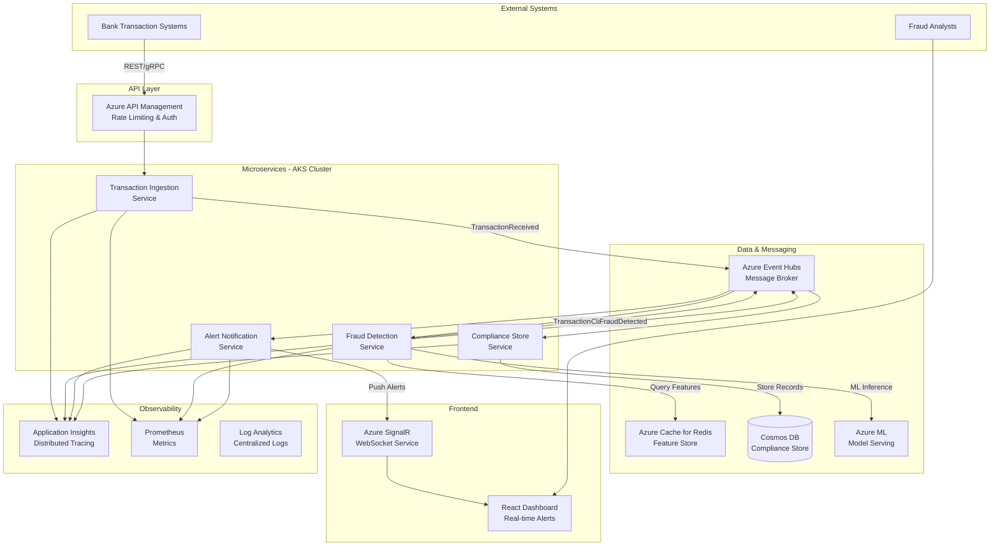
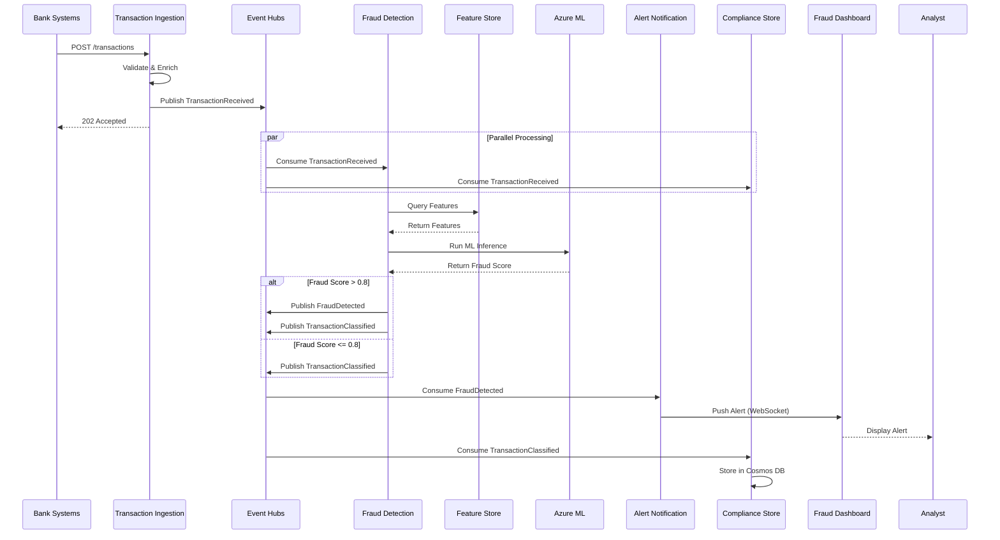
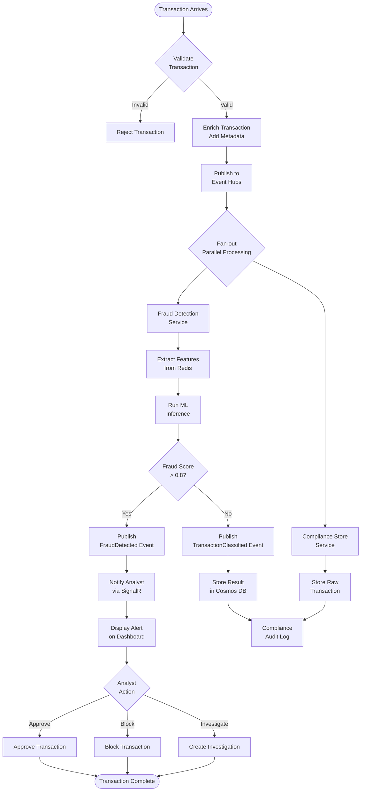
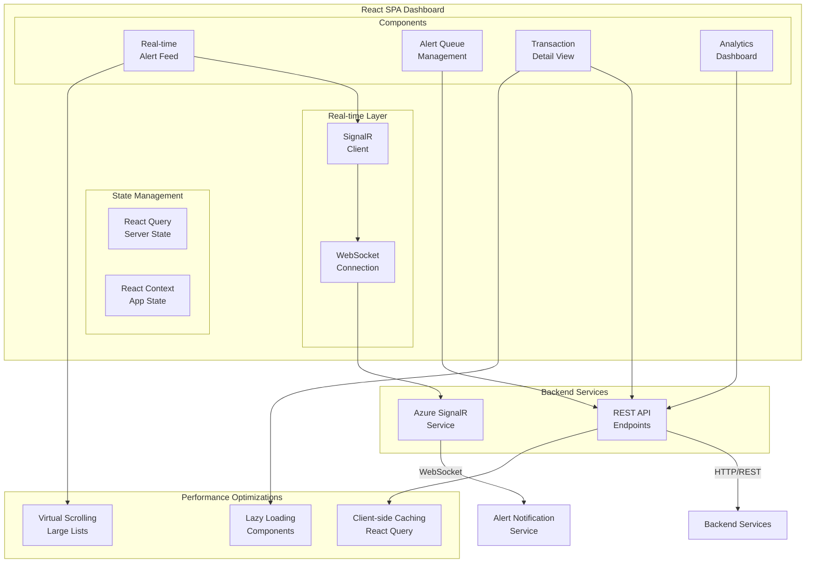
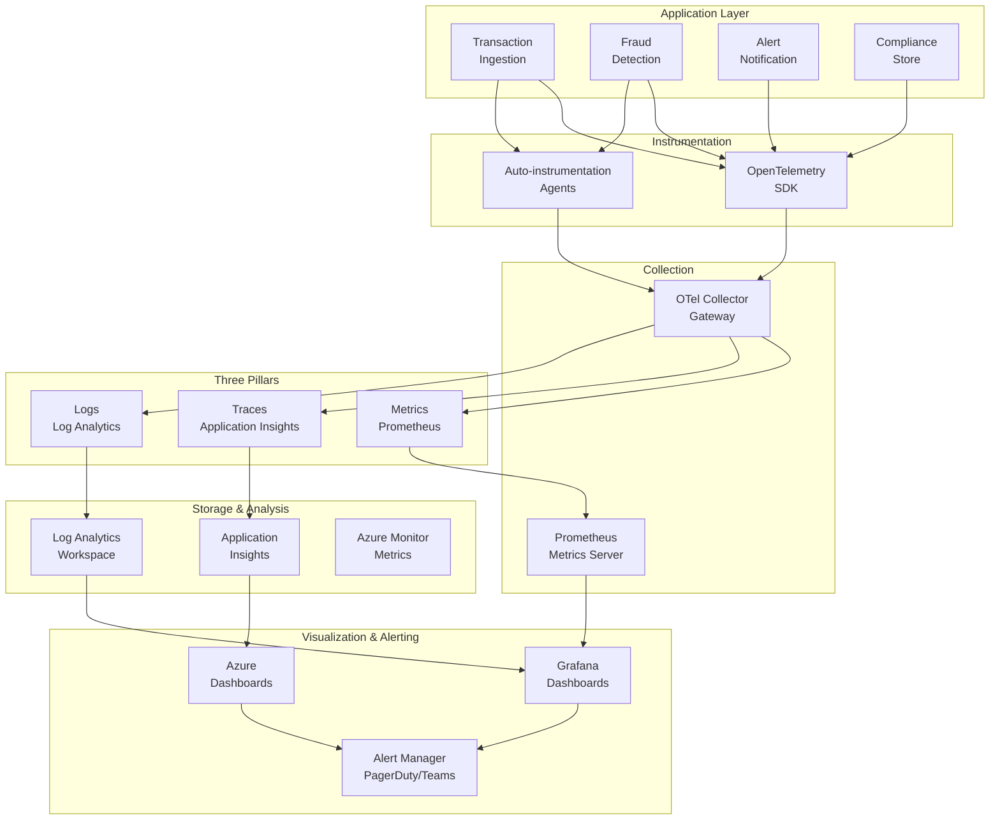
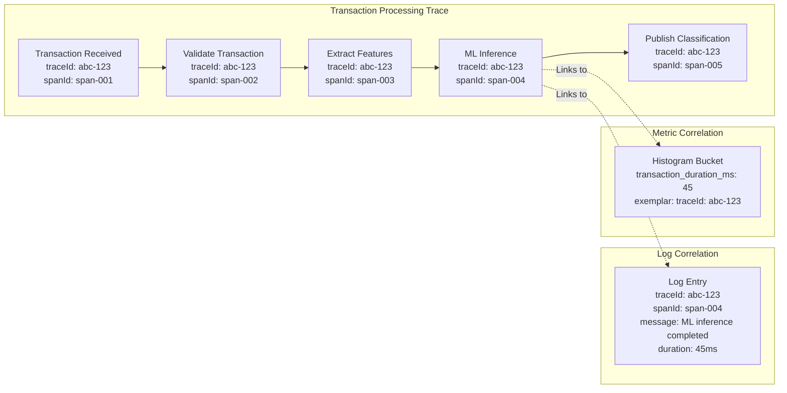
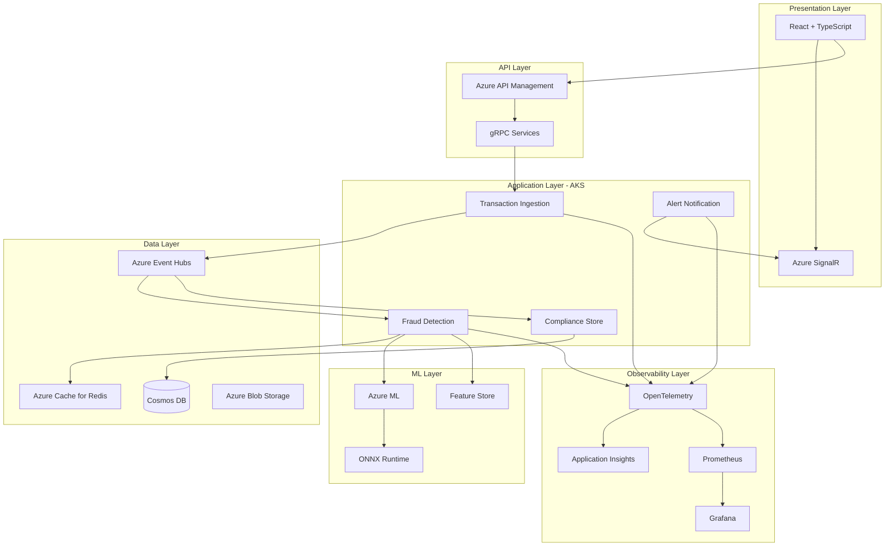
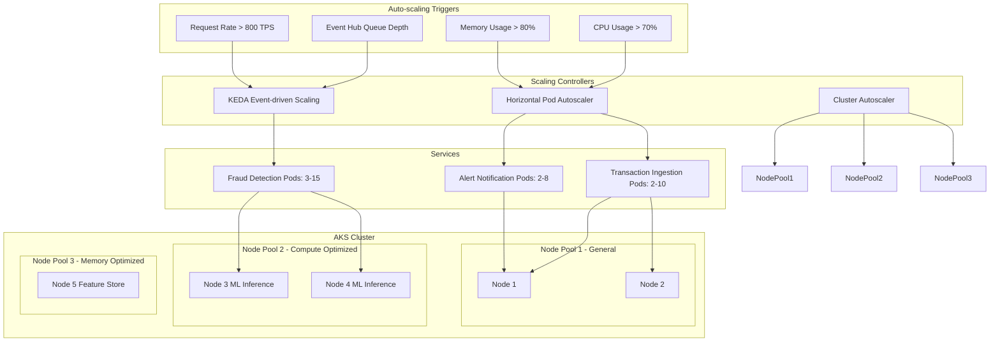
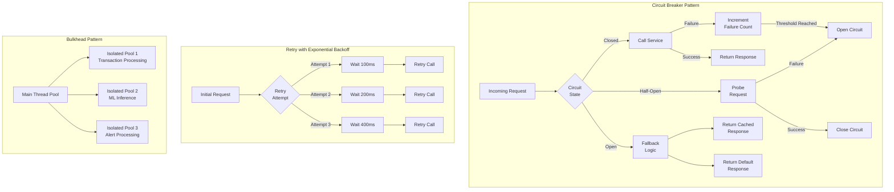
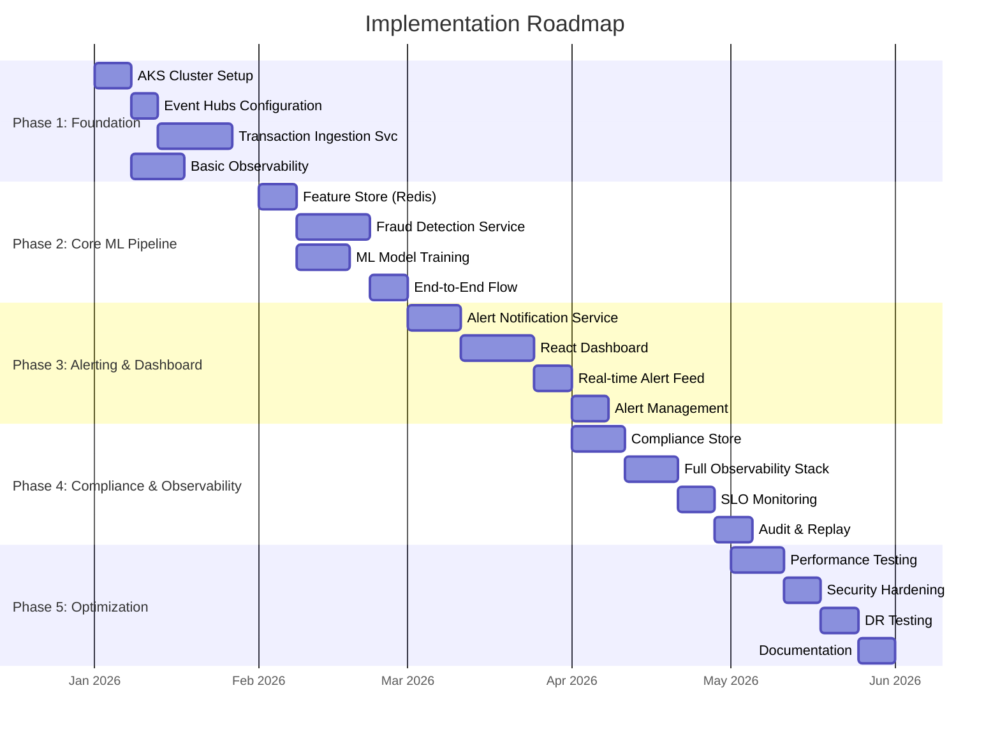

# Candidate Notes

Based on my comprehensive research and analysis, I've developed a complete architecture plan for the high-volume, low-latency financial fraud detection system. Here's the detailed plan:

## Financial Fraud Detection System - Architecture Plan

### Executive Summary

This architecture replaces the aging batch-driven system with a cloud-native, event-driven solution on Microsoft Azure using Kubernetes for elastic scaling. It processes 1,000+ TPS with sub-100ms classification latency, provides real-time alerting, and ensures compliance through complete audit trails.

---

## 1. Core System Requirements Analysis

### Functional Requirements

- **Real-time Transaction Analysis**: Process and classify transactions within <100ms
- **Compliance Replay**: Store raw transactions and ML scores for audit
- **Peak Throughput**: Support 1,000 transactions per second
- **Elastic Scaling**: Auto-scale based on load without peak costs
- **Real-time Alerting**: Frontend dashboard with instant notifications
- **Observability**: Comprehensive monitoring, logging, and tracing

### Non-Functional Requirements

- **Latency**: <100ms for ML classification (p99)
- **Availability**: 99.95% uptime
- **Durability**: Zero data loss for transactions
- **Security**: PCI-DSS compliance, encryption
- **Auditability**: Complete audit trail for regulatory compliance

---

## 2. Microservices Architecture Design

### Solution Architecture Diagram



### Service Decomposition

**Service 1: Transaction Ingestion Service**
- **Responsibility**: Accept transactions, validate, enrich, publish to event stream
- **Inputs**: REST/gRPC API calls
- **Outputs**: TransactionReceived events to Event Hubs
- **Scaling**: HPA based on request rate

**Service 2: Fraud Detection Service**
- **Responsibility**: Consume transactions, extract features, run ML inference, classify
- **Inputs**: TransactionReceived events
- **Outputs**: TransactionClassified events
- **Scaling**: HPA based on queue depth

**Service 3: Alert Notification Service**
- **Responsibility**: Process fraud alerts, notify analysts via frontend
- **Inputs**: FraudDetected events
- **Outputs**: Alert notifications via WebSocket/SSE
- **Scaling**: HPA based on alert volume

**Service 4: Compliance Store Service**
- **Responsibility**: Store transactions and ML scores for replay/audit
- **Inputs**: TransactionReceived and TransactionClassified events
- **Outputs**: Stored records in Cosmos DB
- **Scaling**: Cosmos DB autoscaling

### Inter-Service Communication

- **Synchronous**: REST/gRPC for transaction submission, WebSocket for real-time updates
- **Asynchronous**: Event-driven via Azure Event Hubs for decoupled, scalable messaging

---

## 3. Event-Driven Architecture & Message Schemas

### Event Flow Diagram



### Event Types and Publishers/Consumers

| Event Type | Publisher | Consumers | Purpose |
| ------------ | ----------- | ----------- | --------- |
| `TransactionReceived` | Transaction Ingestion | Fraud Detection, Compliance Store | New transaction available |
| `TransactionClassified` | Fraud Detection | Alert Notification, Compliance Store | ML classification complete |
| `FraudDetected` | Fraud Detection | Alert Notification | High-confidence fraud detected |
| `AlertCreated` | Alert Notification | Fraud Analyst Dashboard | New alert for analyst |
| `AlertAcknowledged` | Fraud Analyst Dashboard | Alert Notification | Analyst acknowledges alert |
| `AlertResolved` | Fraud Analyst Dashboard | Alert Notification | Investigation completed |

### Event Schemas (Avro/JSON)

**TransactionReceived Event:**

```json
{
  "eventId": "uuid-v4",
  "eventType": "TransactionReceived",
  "timestamp": "ISO-8601",
  "data": {
    "transactionId": "string",
    "accountId": "string",
    "amount": "decimal",
    "currency": "string",
    "merchantId": "string",
    "transactionType": "enum[DEBIT|CREDIT|TRANSFER]",
    "location": {"latitude": "decimal", "longitude": "decimal"},
    "deviceId": "string",
    "channel": "enum[MOBILE|WEB|ATM|BRANCH]"
  }
}
```

**TransactionClassified Event:**

```json
{
  "eventId": "uuid-v4",
  "eventType": "TransactionClassified",
  "data": {
    "transactionId": "string",
    "fraudScore": "decimal[0.0-1.0]",
    "decision": "enum[APPROVE|DECLINE|REVIEW]",
    "modelVersion": "string",
    "features": {
      "velocityScore": "decimal",
      "locationScore": "decimal",
      "amountScore": "decimal"
    },
    "processingTimeMs": "integer"
  }
}
```

**FraudDetected Event:**

```json
{
  "eventId": "uuid-v4",
  "eventType": "FraudDetected",
  "data": {
    "transactionId": "string",
    "accountId": "string",
    "fraudScore": "decimal",
    "riskLevel": "enum[LOW|MEDIUM|HIGH|CRITICAL]",
    "fraudType": "enum[IDENTITY_THEFT|CARD_FRAUD|ACCOUNT_TAKEOVER|OTHER]",
    "recommendedAction": "enum[HOLD_ACCOUNT|BLOCK_CARD|REVIEW|NOTIFY_CUSTOMER]"
  }
}
```

---

## 4. End-to-End Transaction Flow

### Transaction Processing Flow Diagram



---

## 5. Frontend Design for Fraud Analysts

### Frontend Architecture Diagram



### Key Features

1. **Real-time Alert Feed**: WebSocket connection, color-coded alerts, sound notifications
2. **Alert Queue Management**: Filterable/sortable list, assignment workflows, status tracking
3. **Transaction Detail View**: Complete history, ML model explanation, geographic visualization
4. **Performance Optimizations**: Virtual scrolling, connection pooling, lazy loading

---

## 6. Observability Strategy

### Observability Architecture Diagram



### Three Pillars of Observability

#### Metrics Collection (Azure Monitor + Prometheus)

**Key Metrics:**

1. **Transaction Processing Latency**: p99 < 100ms (alert: >150ms for 5 min)
2. **Fraud Detection Accuracy**: >95% true positive rate (alert: <90% for 1 hour)
3. **System Throughput**: Handle 1,000 TPS (alert: <800 TPS)
4. **Error Rates**: <0.1% (alert: >1% for 5 min)
5. **ML Model Inference Latency**: p99 < 50ms (alert: >75ms for 5 min)

#### Distributed Tracing (Azure Application Insights + OpenTelemetry)

- End-to-end tracing from ingestion to alert generation
- Correlation IDs propagated across all services
- Custom spans for ML inference and feature extraction
- Sampling: 100% for errors, 10% for successful transactions

#### Centralized Logging (Azure Log Analytics + Serilog)

- Structured JSON logging across all services
- Correlation IDs for request tracing
- Retention: 90 days for compliance, 30 days for operational

### Trace Correlation Diagram



### SLOs (Service Level Objectives)

| SLI | SLO | Measurement | Alert Threshold |
| ----- | ----- | ------------- | ----------------- |
| Transaction Processing Latency | p99 < 100ms | 5-minute window | p99 > 150ms for 5 min |
| System Availability | 99.95% uptime | 30-day window | <99.9% |
| Fraud Detection Accuracy | >95% TPR | Daily | <90% for 1 hour |
| Alert Notification Latency | <1 second | Per-alert | >2 seconds for 5% |
| Data Durability | Zero loss | Continuous | Any loss event |

### Correlation Strategy

- **Trace-Log**: Every log includes `traceId` and `spanId`
- **Metric-Trace**: Exemplars link high-latency metrics to specific traces

---

## 7. Technology Stack

### Core Technologies

| Component | Technology | Justification |
| ----------- | ------------ | --------------- |
| Container Orchestration | Azure Kubernetes Service (AKS) | Managed K8s with auto-scaling, enterprise security |
| Message Broker | Azure Event Hubs | High-throughput, low-latency streaming (1M+ TPS) |
| API Gateway | Azure API Management | Rate limiting, auth, request routing |
| ML Model Serving | Azure ML + ONNX Runtime | Real-time inference with <50ms latency |
| Feature Store | Azure Cache for Redis | Sub-millisecond feature retrieval |
| Compliance Database | Azure Cosmos DB | Global distribution, automatic indexing |
| Real-time Updates | Azure SignalR | Managed WebSocket service |
| Frontend | React + TypeScript | Component-based UI with strong typing |
| Observability | OpenTelemetry + Azure Monitor | Vendor-neutral instrumentation |
| Logging | Serilog + Azure Log Analytics | Structured logging with powerful queries |

### ML Model Stack

- **Training**: Azure ML + Scikit-learn/XGBoost
- **Format**: ONNX for cross-platform optimization
- **Serving**: Azure ML Managed Endpoints with auto-scaling
- **Feature Engineering**: Apache Spark on Azure Synapse

### Technology Stack Diagram



---

## 8. Scalability & Resilience

### Scaling Architecture Diagram



### Scaling Strategies

- **Microservices**: HPA based on CPU/memory and custom metrics, KEDA for Event Hub consumers
- **Analytic Workloads**: Azure Synapse Analytics for batch features, Cosmos DB autoscaling
- **Event Messaging**: Event Hubs auto-inflate, partition-based parallelism

### Resilience Patterns



- **Circuit Breaker**: For ML model calls with rule-based fallback
- **Retry with Exponential Backoff**: All inter-service communication
- **Bulkhead Pattern**: Isolated thread pools for different operations

### Single Points of Failure Mitigation

| Component | SPOF Risk | Mitigation |
| ----------- | ----------- | ------------ |
| Event Hubs | Medium | Geo-redundant, auto-inflate |
| Cosmos DB | Low | Multi-region writes, automatic failover |
| AKS Cluster | Low | Multi-zone deployment |
| ML Model Service | Medium | Multi-region, fallback rules |

---

## 9. Trade-offs & Challenges

### Key Trade-offs

1. **Latency vs. Accuracy**: Optimized for <100ms latency, may sacrifice complex features → Use lightweight models with feature pre-computation
2. **Cost vs. Performance**: Real-time ML inference → Auto-scaling for cost optimization
3. **Consistency vs. Availability**: Eventual consistency for non-critical data → Strong consistency for transactions

### Financial Services Challenges

- **Regulatory Compliance**: PCI-DSS, SOX, GDPR → Encryption, access controls, audit logging
- **Data Privacy**: Customer PII → Data masking, tokenization, RBAC
- **Audit Requirements**: Complete replay → Immutable event store in Cosmos DB

---

## 10. Implementation Roadmap

### Implementation Timeline Diagram



### Phase 1: Foundation (Weeks 1-4)
- AKS cluster and networking setup
- Event Hubs configuration
- Transaction Ingestion Service implementation
- Basic observability setup

### Phase 2: Core ML Pipeline (Weeks 5-8)
- Feature Store (Redis) deployment
- Fraud Detection Service implementation
- ML model training and deployment
- End-to-end transaction flow

### Phase 3: Alerting & Dashboard (Weeks 9-12)
- Alert Notification Service implementation
- React dashboard with SignalR
- Real-time alert feed
- Alert management workflows

### Phase 4: Compliance & Observability (Weeks 13-16)
- Compliance Store implementation
- Full observability stack
- SLO monitoring and alerting
- Audit and replay capabilities

### Phase 5: Optimization & Hardening (Weeks 17-20)
- Performance testing and optimization
- Security hardening
- Disaster recovery testing
- Documentation and runbooks

---

## 11. Conclusion

This architecture provides a scalable, resilient, and observable fraud detection system that meets all requirements:

✅ **Real-time processing**: <100ms classification latency  
✅ **Elastic scaling**: AKS with HPA/KEDA for cost optimization  
✅ **Compliance**: Complete audit trail with replay capability  
✅ **Real-time alerting**: SignalR-powered dashboard for analysts  
✅ **Observability**: Comprehensive metrics, traces, and logs with SLOs  
✅ **Peak throughput**: 1,000+ TPS with Event Hubs  
✅ **Resilience**: Circuit breakers, retries, and multi-region deployment

The event-driven design ensures loose coupling and independent scaling, while the comprehensive observability stack provides visibility into system health and performance for operational excellence.
